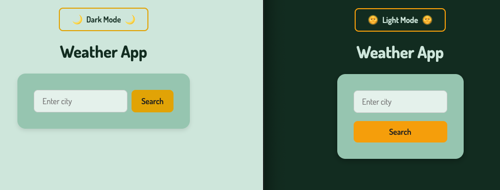
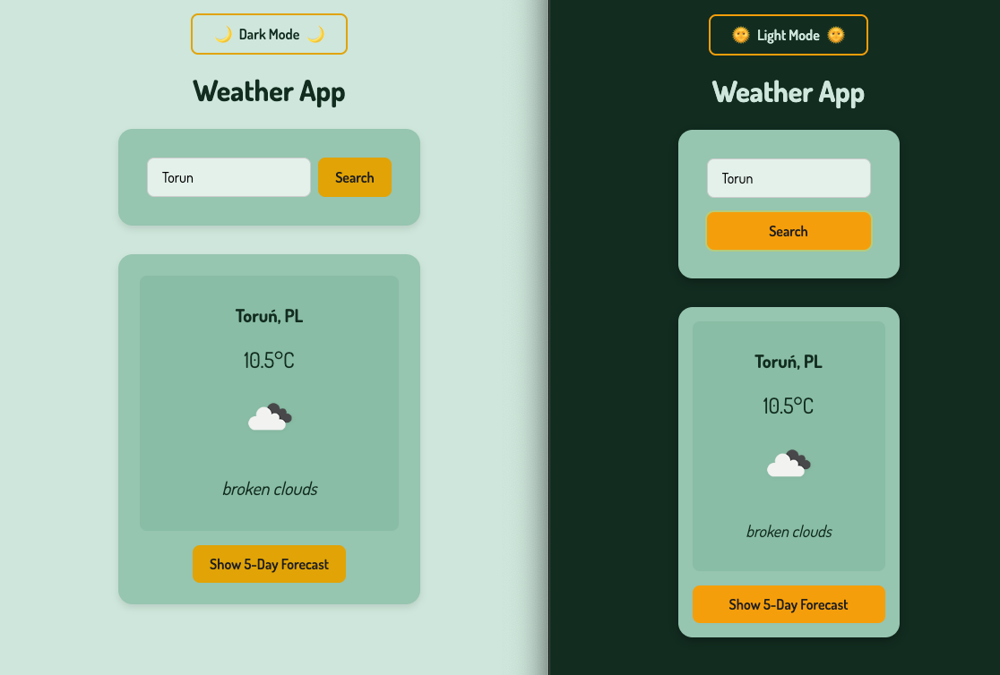
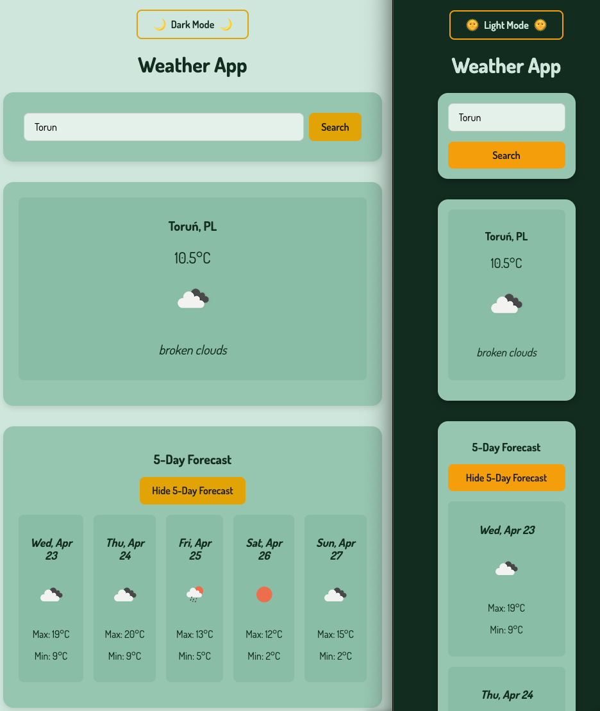

# 🌦️ Weather App – Vanilla JS

A clean and responsive weather application built with HTML, CSS (BEM), and Vanilla JavaScript.  
It fetches real-time weather data from a public API, allows users to search for cities, and displays current weather conditions along with a short forecast.

🛠 This project is currently under development. Features will be implemented step by step in upcoming versions.

## 🔗 Live Demo

[👉 View the Demo](https://dor-ka.github.io/frontend-vanilla-js-weather-app/)

## 📸 Screenshots

## 🔮 Planned Features

- 🌍 Search weather by city name
- ☀️ Display current temperature, weather description, icon, humidity, and wind speed
- 📆 3- or 5-day weather forecast
- 🌗 Light / Dark mode toggle
- 📱 Fully responsive design
- 🧠 Built with clean Vanilla JavaScript and modern CSS (BEM)

## 🚀 Technologies

- HTML5
- CSS3 + BEM
- Vanilla JavaScript (ES6+)
- Fetch API
- OpenWeatherMap API (or other public API)
- Responsive Design

## 📌 Project Structure

📁 frontend-vanilla-js-weather-app    
├── 📄 index.html    
├── 📁 css   
&emsp;├── 📄 style.css   
&emsp;├── 📄 theme.css   
&emsp;├── 📄 weather.css   
├── 📁 js   
&emsp;├── 📄 app.js    
&emsp;├── 📄 api.js   
├── 📁 img   
&emsp;├── favicon-v2.png   
&emsp;├── og-img.png    
&emsp;├── screenshot-light.png    
&emsp;└── screenshot-dark.png    
└── 📄 README.md

## 📈 Versions

### v0.1 – Project Initialization

- Created basic HTML, CSS, JS files
- Added favicon, OG tags, and meta setup
- Prepared GitHub repo and live demo link

### v0.2 –  Light / Dark Mode & Layout Updates
- Created basic HTML structure for Weather App
- Implemented theme toggle with localStorage support
- Designed both light and dark modes with smooth transitions and accessible color palettes
- Centered the main content (header + sections)
- Implemented city search and weather display

### v0.3 – Weather API Integration
- Connected the app to the OpenWeatherMap API
- Created api.js module for structured API calls
- Implemented city search via input field and submit button
- Displayed current weather data: temperature, description, and icon
- Handled basic loading and error states

### v0.4 – 5-Day Forecast Feature
- Fetched and displayed 5-day weather forecast from the API
- Added new section for multi-day forecast
- Improved API structure and data rendering logic
- Refactored JS-related DOM class names to use js- prefix for better separation of concerns

### v0.5 – Responsiveness
- Designed fully responsive and works seamlessly across devices with different screen widths:
  - Below 560px: Layout adjustments for a compact interface.
  - Below 520px: Weather forecast items wrap and are displayed in a vertical layout. 
  - Below 400px: More compact adjustments for small screens (e.g., padding, font sizes).

### v0.6 – Class-based Visibility Refactor
- Replaced all 'style.display' logic in JavaScript with a single utility class .is-hidden for better readability and maintainability.
- Updated DOM visibility toggles (block/none) to use classList.add() / remove() with .is-hidden. 
- Ensured consistency and separation of concerns between JS and CSS by moving visibility logic into CSS classes.

### v0.7 – Error Handling
- Improve error UI (not just text)

## Security Notes

This project is a demonstration of programming skills and serves educational purposes.
It's important to note that in a real production project, API keys should never be
placed directly in publicly accessible frontend code.

The proper approach for handling API keys in production applications includes:
- Using a backend as a proxy for communication with external APIs
- Using serverless functions (e.g., Netlify Functions, Vercel Edge Functions)
- Securing access through appropriate CORS configuration

For implementation simplicity and demonstration purposes, the API key in this project
is placed directly in the code.

## 🧑‍💻 Author

**Dorota Karpinska**  
GitHub: [@Dor-Ka](https://github.com/Dor-Ka)

---